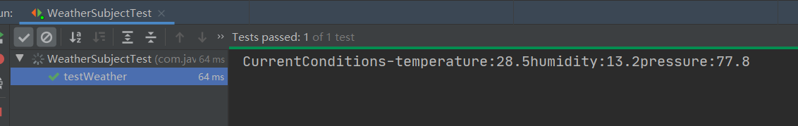

# 设计模式

## 策略模式（Strategy Pattern）
>案例：
- 现有一个父类鸭子*AbstractDuck*，有公共的*swim*和*quack*方法，同时也有抽象方法*display*交由子类实现，现在继承自他的子类就有了两个父类方法和一个待实现的抽象方法
- 问题：现在如果需要鸭子类实现fly()的功能，该怎么实现呢？
- 思路：1. 父类加一个*fly*方法，如果子类有不同实现则重写 --  不是所有鸭子类都有fly()方法，写在父类里不够合理  
  2. 定义一个*Flyable*接口，只有会fly的鸭子才实现，而且每个子类的fly()动作可能还不一致 -- 无法解决代码复用的问题，每次需要修改逻辑都要找到接口的实现类去检查，要是需要重写的方法多了的话，呵呵。。

~~~java 
public abstract class AbstractDuck {
    //抽象方法，交由子类去实现
    protected abstract void display();
    protected void swim() {
        System.out.println("hua la la");
    }
    /*-------下面的方法不是所有子类实现都一样，可以想办法优化-------------*/
    protected void quack() {
        System.out.println("gua gua");
    }
    protected void fly() {
        //emm..好像有什么问题，不是所有的鸭子都会飞
        System.out.println("I believe I can fly");
    }
}
~~~

相信你也看到了，这两种实现方式不够完美，那我们该怎么优雅的实现呢，答案就是引入**策略者模式**

>先看定义：
>在策略模式中，一个类的行为或其算法可以在运行时更改。这种类型的设计模式属于行为型模式。  
>我们创建表示各种策略的对象和一个行为随着策略对象改变而改变的context对象。策略对象改变context对象的执行算法。
>简单来说，分离程序中经常变化的部分，定义成相应的接口，然后交由主类去调用

>具体怎么实现呢，结合案例来看
- 首先在父类*SuperDuck*中定义两个实例变量*FlyBehavior,QuackBehavior*，声明为接口类型，每个子类可以动态地设置这些变量以在运行时引用正确的行为类型（接口的不同实现类）
- 定义相应的*performFly*方法和*performQuack*方法，实现的话直接调用接口变量相应的方法
- 父类定义*setFlyBehavior*方法,*setQuackBehavior*方法，这样可以随时给其子类添加相应的方法和行为

~~~java
public abstract class SuperDuck {
    protected FlyBehavior flyBehavior;
    protected QuackBehavior quackBehavior;
    
    //抽象方法，交由子类去实现
    protected abstract void display();
    protected void swim() {
        System.out.println("hua la la");
    }
    public void performFly() {
        flyBehavior.fly();
    }
    public void performQuack() {
        quackBehavior.quack();
    }
    public void setFlyBehavior(FlyBehavior flyBehavior) {
        this.flyBehavior = flyBehavior;
    }
    public void setQuackBehavior(QuackBehavior quackBehavior) {
        this.quackBehavior = quackBehavior;
    }
}

public interface FlyBehavior {
    void fly();
}

public interface QuackBehavior {
    void quack();
}

public class FlyWithWings implements FlyBehavior {
    @Override
    public void fly() {
        System.out.println("I believe I can fly");
    }
}

public class FlyNoWay implements FlyBehavior {
    @Override
    public void fly() {
        System.out.println("No way,you can't fly");
    }
}

public class Quack implements QuackBehavior {
    @Override
    public void quack() {
        System.out.println("gua gua");
    }
}

public class MuteQuack implements QuackBehavior {
    @Override
    public void quack() {
        System.out.println("mute");
    }
}

public class MallarDuck extends SuperDuck {
    public MallarDuck() {
        this.flyBehavior = new FlyWithWings();
        this.quackBehavior = new Spueak();
    }

    @Override
    protected void display() {
    }
}

public class MiniDuckSimular {
    public static void main(String[] args) {
        SuperDuck mallarDuck = new MallarDuck();

        mallarDuck.performFly();
        mallarDuck.performQuack();
    }
}
~~~

>我们学到了哪些设计原则：
>1. 找出应用中可能需要变化之处，把它们独立出来，不要和那些不需要变化的代码混在一起（封装变化）
>>   * 如果每次需求一来，就会使某方面代码发生变化，那么就需要抽离了
>>   * 当涉及"维护"时，为了服用而使用继承可能结局并不完美
>2. 针对接口编程，而不是针对实现编程  
>3. 多用组合，少用继承（IS-A 比 HAS-A 更好）

## 观察者模式（Obsever Pattern）
>先来看个案例：
- 建立一个应用，通过已有的WeatherData对象取得数据，并且更新到相应布告板:当前状态，气象统计和天气预报
- 当WeatherData获取到新的数据时能实时更新到布告板
- 可扩展性，支持添加新的布告板

~~~java
public class WeatherData {

    /**下面方法获取最新的气象数据，具体实现我们不关心*/
    public Double getTemperature() {return 0.0D;}

    public Double getHumidity() {return 0.0D;}

    public Double getPressure() {return 0.0D;}

    /**气象数据被更新时，调用此方法*/
    public void measurementsChanged() {
        //需要实现该方法逻辑
    }
}
~~~
> 错误示例：
~~~java_holder_method_tree
    public void measurementsChanged() {
        Double temperature = getTemperature();
        Double humidity = getHumidity();
        Double pressure = getPressure();

        //调用相应方法更新当前状况,天气统计，天气预报  很low
        //针对具体实现编程，导致后续代码逻辑改动代价太大
        currcuentConditionsDisplay.update(temperature,humidity,pressure);
        statisticsDisplay.update(temperature,humidity,pressure);
        forecastDisplay.update(temperature,humidity,pressure);
    }
~~~
解决这类问题，就用到我们接下来要聊的**观察者模式**了
>定义：
>观察者模式定义了对象之间的一对多依赖，当一个对象改变其状态时，它的所有依赖者都会收到通知并自动更新
>
>常用实现：
>定义Subject接口（主题对象）和Obsever接口(观察者)，当subject发生变化时通知到obsever

Subject-主题接口，定义了相应的注册和注销观察者的方法，并且在对象信息发生变化时通知到相应的观察者

~~~java
public interface Subject {
    //注册
    void registerObsever(Obsever obsever);
    //注销
    void removeObsever(Obsever obsever);
    //通知
    void notifyObsever();
}
~~~

Obsever-观察者接口，所有潜在的观察者必须实现观察者接口，具体方法可以自己定义，结合上述案例这里的观察者只需要一个update()方法用来更新气象数据

~~~java
public interface Obsever {
    void update(Double temperature, Double humidity, Double pressure);
}
~~~

主题是真正拥有数据的对象，观察者是主题的依赖者，在数据变化更新时，通过notifyObsever()方法来通知观察者更新数据。  
>为什么要用观察者模式?

观察者模式提供了对象设计，让主题和观察者之间松耦合；当两个对象之间松耦合，它们依然可以交互，但是不清楚彼此的实现细节  

关于观察者的一切，主题只知道观察者实现了某个接口（也就是Observer接口）。主题不需要知道观察者的具体类是谁、做了些什么或其他任何细节。

任何时候我们都可以增加新的观察者。因为主题唯一依赖的东西是一个实现Observer接口的对象列表，所以我们可以随时增加观察者。
事实上，在运行时我们可以用新的观察者取代现有的观察者，主题不会受到任何影响。同样的，也可以在任何时候删除某些观察者。

有新类型的观察者出现时，主题的代码不需要修改。我们可以独立地复用主题或观察者。如果我们在其他地方需要使用主题或观察者，可以轻易地复用。因为二者并非紧耦合。

改变主题或观察者其中一方，并不会影响另一方。因为两者是松耦合的，所以只要他们之间的接口仍被遵守，我们就可以自由地改变他们。

>这里学到了另一个程序设计原则：  
>* 为了交互对象之间的松耦合设计而努力  
>   * 松耦合的设计之所以能让我们建立有弹性的OO系统，能够应对变化，是因为对象之间的互相依赖降到了最低。

>理论说了那么多，现在开始愉快的敲代码环节吧
>1. 定义需要的接口，主题对象（Subject）和观察者（Obsever）我们已经滚定义好了，除此之外还需要再定义一个接口用于数据展示（DisplayElement）
~~~java
public interface DisplayElement {
    //展示获取到的气象数据
    void display();
}
~~~
>2. 重新定义气象数据对象，这次不再简单的定义一个WeatherData，而是实现Subject接口把它作为一个观察者模式的主题对象
~~~java
public class WeatherSubject implements Subject {
    /**
     * 定义依赖该主题的所有观察者列表
     */
    private List<Obsever> obseverList;
    //气象数据  温度，湿度，气压
    private Double temperature;
    private Double humidity;
    private Double pressure;

    public WeatherSubject() {
        //初始化观察者列表
        this.obseverList = new ArrayList<>();
    }

    /**
     * 注册观察者信息
     * @param obsever
     */
    @Override
    public void registerObsever(Obsever obsever) {
        this.obseverList.add(obsever);
    }

    /**
     * 移除观察者信息
     * @param obsever
     */
    @Override
    public void removeObsever(Obsever obsever) {
        this.obseverList.remove(obsever);
    }

    /**
     * 通知贯观察者数据更新
     * ps:我只负责通知，具体你拿到数据要干什么就与我无关了
     */
    @Override
    public void notifyObsever() {
        obseverList.forEach(obsever -> obsever.update (temperature,humidity,pressure));
    }

    /**
     * 对外暴露方法
     */
    public void measurementsChanged() {
        notifyObsever();
    }

    /**
     * 模拟获取气象信息方法
     * @param temperature
     * @param humidity
     * @param pressure
     */
    public void setMeasurements(Double temperature,Double humidity,Double pressure) {
        this.temperature = temperature;
        this.humidity = humidity;
        this.pressure = pressure;
        measurementsChanged();
    }
}
~~~
>3. 建立布告板对象，同样的，作为观察者实现Obsever接口，同时实现DisplayElement接口来展示数据
~~~java
public class CurrentConditionsDisplay implements Obsever, DisplayElement {
    
    private Double temperature;
    private Double humidity;
    private Double pressure;

    /**
     * 构造器需要对应的主题对象来把自身注册到该主题上去
     * @param weatherSubject
     */
    public CurrentConditionsDisplay(Subject weatherSubject) {
        weatherSubject.registerObsever(this);
    }

    /**
     * 展示就简单的打印吧
     */
    @Override
    public void display() {
        System.out.println("CurrentConditions-temperature:"+temperature+"humidity:"+humidity+"pressure:"+pressure);
    }

    /**
     * 通知观察者后调用update()方法
     * 更新完后直接展示，调用display()方法
     * @param temperature
     * @param humidity
     * @param pressure
     */
    @Override
    public void update(Double temperature, Double humidity, Double pressure) {
        this.temperature = temperature;
        this.humidity = humidity;
        this.pressure = pressure;
        display();
    }
}
~~~
>4. 测试
~~~java
public class WeatherSubjectTest {
    @Test
    public void testWeather() {
        WeatherSubject weatherSubject = new WeatherSubject();
        CurrentConditionsDisplay currentConditionsDisplay = new CurrentConditionsDisplay(weatherSubject);
        weatherSubject.setMeasurements(28.5D,13.2D,77.8D);
    }
}
~~~

>至此，一个简单的观察者模式就写完了，那么这样就好了吗，当然不是，程序优化的路时永无止境的  
>让我们研究下这个程序还有什么问题

>* 现有的数据更新方式是主题对象更新后通知到对应的所有观察者，相当于是主动“推”的过程
>* 但是主题对象并不清除观察者的具体作用，而每个观察者的需求也是不一致的，这里是不是让观察者自己主动去“拉”数据比较合适呢  
>（什么？上面的案例不就是每个观察者都需要所有的数据吗？  大胆！）
>* 这样一来作为观察者可以决定我什么时候去拉数据，拉哪些数据
>* 而当主题对象的数据发生扩展后也不需要修改和更新对每个观察者的调用，只需改变自己来允许观察者获取到新增的数据即可

emm...这就像甜棕和咸棕之争，这么多年来一直没有结果，毕竟个人口味不同，而我们实际开发过程中遇到的场景也不尽相同，
难道我们需要开发两套模板来满足平常的工作需要吗，当然...不是，其实在Java API中已经内置了观察者模式，支持两种类型的数据更新

>使用Java内置的观察者模式
- 首先需要了解两个java内置类/接口 *java.util.Observable*   *java.util.Observer*
    - Observable，可观察者，可以追踪所有的观察者，并通知他们；可变的数据对象直接继承它就行
        - 工作流程：  
            a. 先调用*setChanged*方法，标记数据对象状态已被改变  
            b. 调用*notifyObservers()* 或者 *notifyObservers(Object arg)* 方法通知观察者
        - *setChanged*是干什么的呢？
            - 用来标记状态已改变，好让*notifyObservers()* 知道当它被调用时应该更新观察者（可以看下*notifyObservers*源码）
            - 通过这样的方式让更新观察者时有更多的弹性，可以选择在适当的时候通知观察者，到时候重写下*setChanged*方法就好，是不是很人性
    - Observer，观察者接口，和我们之前自己实现的接口作用一致,不同的是方法多了两个参数，observable和数据对象（就是 *notifyObservers(Object arg)* 传的arg）
        - 如果想通过”推“的方式通知观察者，就可以把数据当作数据对象传到 *notifyObservers(Object arg)* 中，否则观察者就得从可观察对象中”拉“数据
- 看到这里基本知道该怎么做了吧
    - 定义*WeatherObservable*，继承Observable
        - 这里构造器就不需要初始化观察者列表了，也不需要手动管理观察者列表了，为什么呢，因为父类里有了
        - *measurementsChanged*里调用*notifyObservers()*，没有传参数，所以是通过”拉“的方式实现数据更新（要先调用*setChanged()* 方法）
        - 定义相应的*getXXX()* 方法，”拉“的方式必需
    - 定义*CurrentConditionsObserver*，实现*Observer*, *DisplayElement*
        - 构造器调用*observable.addObserver(this)*，把*CurrentConditionsObserver*注册为观察者
        - 实现*update()* 方法
        - 实现*disPlay()* 方法 
~~~java
public class WeatherObservable extends Observable {
    //气象数据  温度，湿度，气压
    private Double temperature;
    private Double humidity;
    private Double pressure;

    public void measurementsChanged() {
        setChanged();
        notifyObservers();
    }

    /**
     * 模拟获取气象信息方法
     * @param temperature
     * @param humidity
     * @param pressure
     */
    public void setMeasurements(Double temperature,Double humidity,Double pressure) {
        this.temperature = temperature;
        this.humidity = humidity;
        this.pressure = pressure;
        measurementsChanged();
    }

    //当使用”拉“的方式更新数据时，需要用到get方法
    public Double getTemperature() {
        return temperature;
    }

    public Double getHumidity() {
        return humidity;
    }

    public Double getPressure() {
        return pressure;
    }
}
~~~

~~~java
public class CurrentConditionsObserver implements Observer, DisplayElement {
    private Double temperature;
    private Double humidity;
    private Double pressure;

    public CurrentConditionsObserver(Observable observable) {
        observable.addObserver(this);
    }

    @Override
    public void update(Observable o, Object arg) {
        if (o instanceof WeatherObservable) {
            WeatherObservable weatherObservable = (WeatherObservable) o;
            this.temperature = weatherObservable.getTemperature();
            this.humidity = weatherObservable.getHumidity();
            this.pressure = weatherObservable.getPressure();
            display();
        }
    }

    @Override
    public void display() {
        System.out.println("CurrentConditions-temperature:"+temperature+"humidity:"+humidity+"pressure:"+pressure);
    }
}
~~~

>看到这里是不是觉得真香，然而并不是
>- 看下*Observable.notifyObservers()* 源码，你会发现它通知观察者的次序和我们之前自定义的不一样，是倒着来的
>   - 所以，**不要依赖于观察者被通知的次序！！！** 如果我们的业务逻辑依赖于通知次序，那肯定会出问题
>- Observable是一个类而非接口，如果你还想继承别的类那是不可能的，这就限制了Observable的复用潜力  
>
>所以是自己实现还是使用Java内置模板，就看具体场景了

## 装饰模式

## 工厂模式

## 单例模式

## 命令模式

## 适配器模式

## 外观模式

## 模板方法模式

## 迭代器模式

## 组合模式

## 状态模式

## 代理模式

## 复合模式

