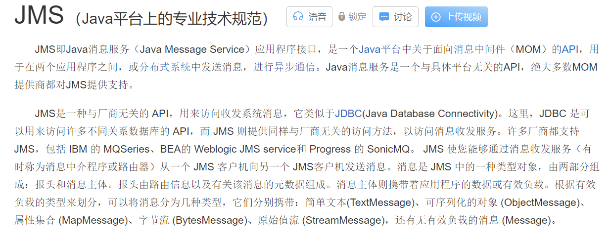
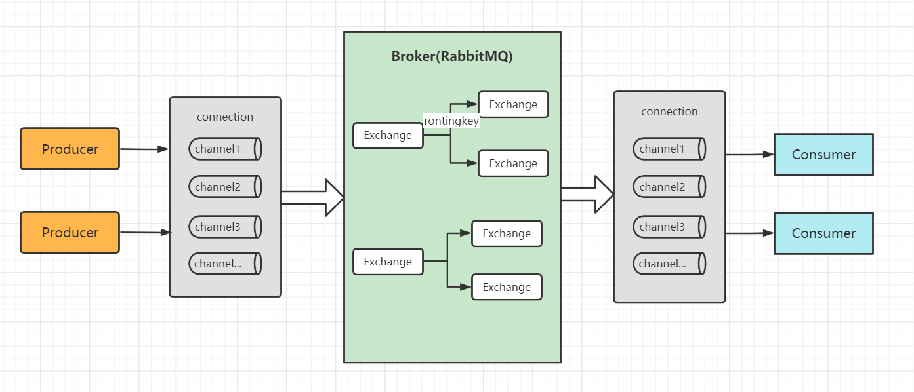
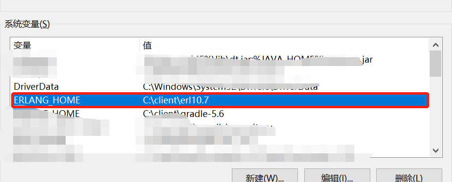
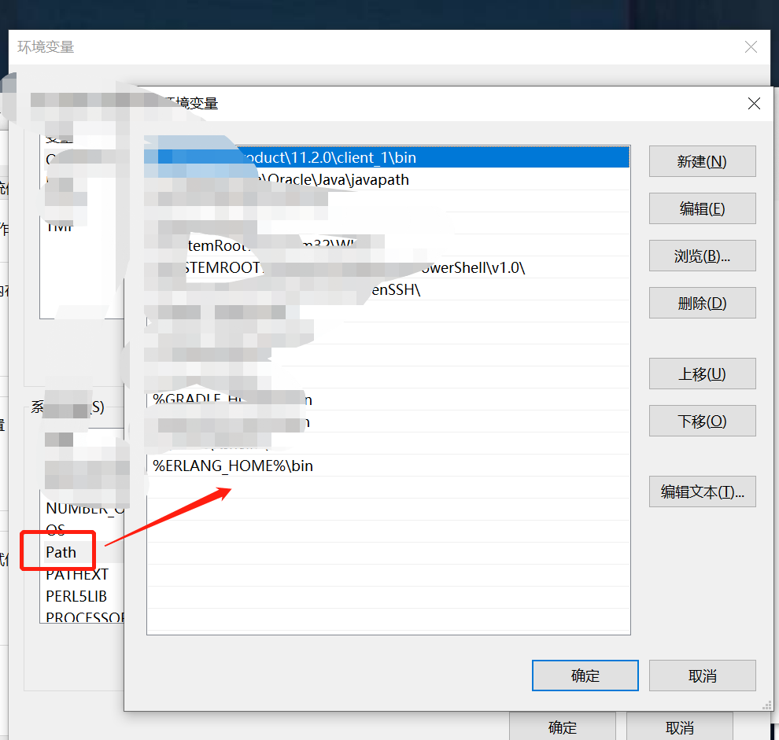
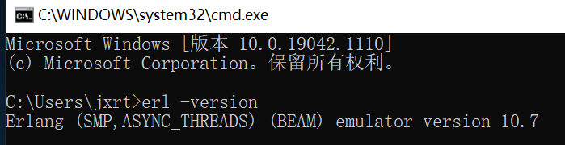
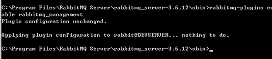

  

>RabbitMQ是由erlang语言开发，基于AMQP（Advanced Message Queue 高级消息队列协议）协议实现的消息队列。
>它是一种应用程序之间的通信方法，在分布式系统开发中应用非常广泛。点击可查看[官网](http://www.rabbitmq.com)及[中文文档](http://rabbitmq.mr-ping.com/)  

## AMQP
AMQP（Advanced Message Queue 高级消息队列协议）一个提供统一消息服务的应用层标准高级消息队列协议，是应用层协议的一个开放标准，为面向消息的中间件设计。基于此协议的客户端与消息中间件可传递消息，并不受客户端/中间件不同产品，不同的开发语言等条件的限制。Erlang中的实现有RabbitMQ等。

总结：AMQP是一套公开的消息队列协议，最早在2003年被提出，它旨在从协议层定义消息通信数据的标准格式，为的就是解决MQ市场上协议不统一的问题。RabbitMQ就是遵循AMQP标准协议开发的MQ服务。

[官网：amqp.org](https://www.amqp.org/)

## JMS
JMS即Java消息服务（Java Message Service）应用程序接口，是一个Java平台中关于面向消息中间件（MOM）的API，用于在两个应用程序之间，或分布式系统中发送消息，进行异步通信。Java消息服务是一个与具体平台无关的API，绝大多数MOM提供商都对JMS提供支持。

## 工作原理 
RabbitMQ基本结构:

 
## 安装与卸载

### Windows环境

#### 安装
1. 安装[Erlang](https://www.erlang.org/downloads)  
2. 配置Erlang环境变量   
    2.1 新增ERLANG_HOME环境变量，值为Erlang安装目录  
      
    2.2 Path变量下追加%ERLANG_HOME%\bin(指向Erlang安装目录下bin文件夹)  
      
    2.3 验证是否安装成功：命令行下执行erl -version  
      
3. 安装[RabbitMQServer](https://www.rabbitmq.com/download.html) (选择安装目录下无脑下一步即可)
4. 安装RrabbitMQ可视化插件  
    4.1 RabbitMQ安装成功后正常情况下会自动启动，如果启动失败则执行sbin目录下rabbitmq-server.bat启动  
    4.2 sbin目录下命令行模式执行rabbitmq-plugins enable rabbitmq_management  
      
    4.3 浏览器访问地址http://localhost:15672/ 即可登录，用户名/密码：guest/guest     
    * Erlang与RabbitMQ安装版本需对应，否则RabbitMQ启动会有问题，对应版本看 [这里](https://blog.csdn.net/weixin_39802680/article/details/110307169) 或自行百度  
    * Erlang官网访问比较慢，如果没有好的镜像环境下载后建议保存安装包  
    
#### 卸载
1. 打开Windows任务管理器。
2. 在任务管理器中，查找进程epmd.exe。 如果此进程仍在运行，请右键单击该进程，然后单击“结束进程”。
3. 打开Windows控制面板，双击“程序和功能”。
4. 在当前安装的程序列表中，右键单击RabbitMQ Server，然后单击“卸载”。
5. 在当前安装的程序列表中，右键单击“Erlang OTP”，然后单击“卸载”。
6. 删除RabbitMQ和Erlang的所有安装目录。
7. 删除文件C:\Windows\.erlang.cookie（如果存在）。
8. 转到用户文件夹：C:\Users\[username]，然后删除文件.erlang.cookie。删除
9. 同样在User文件夹中，转到AppData\Roaming\RabbitMQ，删除RabbitMQ文件夹。　　
10. 打开运行cmd->sc delete RabbitMQ。
11. 打开运行->regedit 找到RabbitMQ节点，删掉即可。
    

